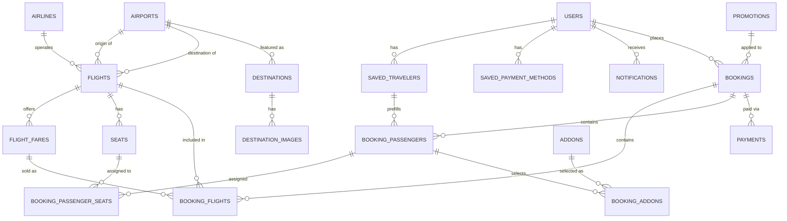

# LORE — Entity-Relationship Design

Based strictly on `Lore-System.md`. Entities are grouped by domain, with ambiguities flagged where the source doc doesn't fully settle a design decision.

## 1. Ambiguities to resolve before building the schema

1. **Admin vs. customer accounts** — the doc never says whether admins live in a separate table or in the same `users` table with a role flag. Assumed **one `users` table with a `role` column** (simplest, common pattern) — confirm that's acceptable.
2. **Airports as managed data** — Section 13 lets admins set From/To per flight, but there's no "Admin — Airport Management" module. Added an `airports` lookup table as required reference data, but it's unclear if admins manage it directly or if it's just seeded.
3. **Airline vs. Aircraft** — "Set airline" and "Set aircraft" (Section 13) are listed identically, but I modeled `Airline` as a lookup table (for logo/branding reuse on flight cards) and `aircraft_type` as a plain text field. That split is a judgment call, not stated in the doc.
4. **Saved payment methods** — Section 3 explicitly says "if you decide to support this," and Section 8 says payment is simulated for an academic build. This table may be unnecessary for v1.
5. **Add-ons pricing/catalog** — the booking flow (Sections 7–8) assumes baggage/seat/meal/insurance/priority-boarding all have prices, but no admin module is defined for managing those prices. Added a minimal `addons` catalog table to make the booking summary math possible, but its admin CRUD isn't specified.
6. **Notifications** — appears only as a dashboard nav label (Section 11) with zero detail on triggers or content types (booking updates? flight delays? promos?). Needs definition.
7. **Layovers/connections** — "Non-stop" appears in results and "Layover information" appears in flight details, but the doc never says whether a connecting itinerary is one `Flight` record or a combination of two. Modeled **each `Flight` as one non-stop segment**, with round-trip/multi-city/connections composed at booking time via a junction table.
8. **Fare-rule granularity** — cancellation policy, change policy, and baggage allowance are described as flight-level details (Section 5), but real fare rules usually vary by cabin class. Placed on `flight_fares` (per class) instead of `flights` — confirm that's the intended level.
9. **Promotion discount type** — only a percentage example is given ("10%"); added a `discount_type` field to optionally support fixed-amount discounts too, which isn't explicitly requested.
10. **Profile data vs. saved travelers** — Section 3 lists DOB/nationality/passport as fields on the user's own profile, while also calling out "manage saved passenger information" as a separate capability. Modeled as separate concepts, with an optional link at booking time.

---

## 2. Entities

### Identity

**`users`** (PK: `id`)

| Field | Notes |
|---|---|
| full_name, email (unique), password_hash, phone | core account fields |
| date_of_birth, nationality, passport_number | nullable — only required at booking time (Sec. 3) |
| role | enum: customer, admin |
| status | enum: active, disabled (Sec. 15) |
| created_at, updated_at | |

**`saved_travelers`** (PK: `id`)

| Field | Notes |
|---|---|
| user_id (FK → users) | owner of this saved traveler |
| first_name, middle_name, last_name, date_of_birth, gender, nationality, passport_number | matches Passenger Details fields (Sec. 6) |

**`saved_payment_methods`** (PK: `id`) — *ambiguous, see #4*

| Field | Notes |
|---|---|
| user_id (FK → users) | |
| type, masked_details, is_default | |

**`notifications`** (PK: `id`) — *ambiguous, see #6*

| Field | Notes |
|---|---|
| user_id (FK → users) | |
| title, message, type, is_read, created_at | |

### Flight inventory

**`airlines`** (PK: `id`) — name, iata_code, logo_url

**`airports`** (PK: `id`) — iata_code (unique), name, city, country

**`flights`** (PK: `id`)

| Field | Notes |
|---|---|
| airline_id (FK → airlines) | |
| origin_airport_id (FK → airports) | |
| destination_airport_id (FK → airports) | |
| flight_number, aircraft_type | e.g. "LORE-204", "Airbus A321" |
| departure_datetime, arrival_datetime, departure_terminal, arrival_terminal | |
| status | enum: scheduled, delayed, cancelled, completed (Sec. 13) |

**`flight_fares`** (PK: `id`)

| Field | Notes |
|---|---|
| flight_id (FK → flights) | |
| cabin_class | enum: economy, premium_economy, business, first |
| price, seat_capacity, baggage_allowance, meals_available | |
| cancellation_policy, change_policy, fare_rules | text — see ambiguity #8 |

**`seats`** (PK: `id`)

| Field | Notes |
|---|---|
| flight_id (FK → flights) | |
| seat_number, cabin_class, extra_fee, is_available | unique (flight_id, seat_number) |

### Content (Destinations)

**`destinations`** (PK: `id`)

| Field | Notes |
|---|---|
| airport_id (FK → airports, nullable) | links marketing page to a searchable place |
| name, country, description, hero_image, popularity_score, is_featured | Sec. 17 |

**`destination_images`** (PK: `id`) — destination_id (FK), image_url, sort_order *(resolves Destination's "Gallery" as 1:M)*

### Promotions

**`promotions`** (PK: `id`) — code (unique), discount_type, discount_value, min_booking_amount, expiration_date, is_active (Sec. 18)

### Booking flow

**`bookings`** (PK: `id`)

| Field | Notes |
|---|---|
| user_id (FK → users) | |
| promotion_id (FK → promotions, nullable) | |
| booking_code (unique) | e.g. "LR8X92K" |
| trip_type | enum: one_way, round_trip, multi_city |
| status | enum: pending, confirmed, cancelled, completed (Sec. 14) |
| total_amount, currency, created_at | |

**`booking_flights`** (PK: `id`) — *junction, resolves Bookings M:N Flights*

| Field | Notes |
|---|---|
| booking_id (FK → bookings), flight_id (FK → flights), flight_fare_id (FK → flight_fares) | |
| leg_order, price_at_booking | leg_order supports round-trip (2 legs) / multi-city (N legs) |

**`booking_passengers`** (PK: `id`)

| Field | Notes |
|---|---|
| booking_id (FK → bookings) | |
| saved_traveler_id (FK → saved_travelers, nullable) | optional prefill link |
| first_name, middle_name, last_name, date_of_birth, gender, nationality, passport_number | snapshot at time of booking |
| passenger_type | enum: adult, child, infant (Sec. 4) |

**`booking_passenger_seats`** (PK: `id`) — *junction, resolves Passengers M:N Seats*

| Field | Notes |
|---|---|
| booking_passenger_id (FK), seat_id (FK → seats) | unique per seat_id — one seat, one passenger |
| price_at_booking | |

**`addons`** (PK: `id`) — *catalog, ambiguous, see #5*

| Field | Notes |
|---|---|
| type | enum: baggage, meal, insurance, priority_boarding |
| name, description, price, is_active | |

**`booking_addons`** (PK: `id`) — *junction, resolves Passengers M:N Addons*

| Field | Notes |
|---|---|
| booking_passenger_id (FK), addon_id (FK) | |
| flight_id (FK → flights, nullable) | null = applies to whole booking (e.g. insurance); set = per-leg (e.g. extra bag on one segment) |
| quantity, price_at_booking | |

**`payments`** (PK: `id`)

| Field | Notes |
|---|---|
| booking_id (FK → bookings) | 1 booking : M payments (retries) |
| amount, method, status, transaction_reference | method enum: card, gcash, maya, bank_transfer, other; status enum: pending, paid, failed, refunded (Sec. 14/16) |
| paid_at, refunded_at | |

---

## 3. Relationship / cardinality summary

| Relationship | Cardinality | Resolved via |
|---|---|---|
| Users ↔ Saved Travelers | 1:M | direct FK |
| Users ↔ Bookings | 1:M | direct FK |
| Bookings ↔ Flights | M:N | `booking_flights` |
| Bookings ↔ Passengers | 1:M | direct FK |
| Passengers ↔ Seats | M:N | `booking_passenger_seats` |
| Passengers ↔ Addons | M:N | `booking_addons` |
| Bookings ↔ Payments | 1:M | direct FK |
| Bookings ↔ Promotions | M:1 (optional) | direct FK |
| Flights ↔ Fares | 1:M | direct FK |
| Flights ↔ Seats | 1:M | direct FK |
| Destinations ↔ Images | 1:M | direct FK |
| Airports ↔ Flights | 1:M (×2: origin, destination) | direct FK |

*(VS Code renders the diagram above if you open this file with a Mermaid preview extension, or "Open Preview" if your Markdown preview supports Mermaid. Otherwise, the table above covers the same information.)*

---

## 4. Why the main tables connect this way

**Users → Bookings → Booking_Flights → Flights** is the spine of the whole system. A booking never stores flight details directly — it links through `booking_flights` because a single booking can span multiple flight legs (round trip = 2 legs, multi-city = N legs), and a single flight is sold to many different bookings. This junction is what makes Section 4's "Round trip / One way / Multi-city" possible without duplicating flight data.

**Bookings → Booking_Passengers**, not Users → Passengers directly, because one user can book for other people (family, colleagues) — the passenger flying isn't necessarily the account holder. `booking_passengers` snapshots each traveler's details *at the time of booking* (name, DOB, passport) rather than referencing `users` or even `saved_travelers` live, so that changing your saved profile later doesn't silently rewrite a ticket you already flew on. `saved_traveler_id` is only there as an optional convenience link for prefilling the form.

**Booking_Passenger_Seats and Booking_Addons** both branch off passengers rather than off the booking as a whole, because add-ons and seats are chosen *per person* (Section 7's "interactive seat selection" is a seat map per flight, assigned to one passenger at a time) — and `booking_addons` carries an optional `flight_id` because something like extra baggage might apply to only one leg of a multi-city trip, while travel insurance applies to the whole booking.

**Flight_Fares sits between Flights and pricing** because Section 13's own example shows the same flight priced differently per cabin class ("Economy ₱18,450 / Business ₱42,500") — so price, baggage allowance, and fare rules had to live at the fare-class level, not the flight level, or the schema couldn't represent that example.

**Payments is 1:M off Bookings**, not 1:1, because a simulated (or real) payment can fail and be retried — Section 14 lists a Failed status, which only makes sense if a booking can have more than one payment attempt on record.

**Promotions attaches to Bookings, not Payments**, because the discount is part of what the customer is agreeing to at checkout (Review step, Section 6), and it needs to be applied before the final payable amount is even calculated.

**Destinations is deliberately separate from Airports** — Airports is operational data flights need for routing (MNL, NRT), while Destinations is marketing content for the landing page (hero image, gallery, popularity, featured flag). The optional FK from Destinations to Airports just lets a "Tokyo" landing-page card deep-link into a real, searchable flight destination — it's not the same entity wearing two hats.
